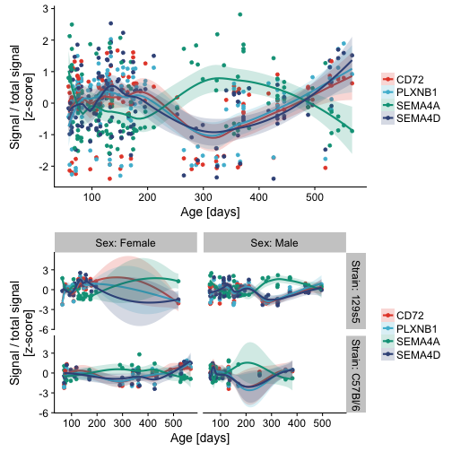
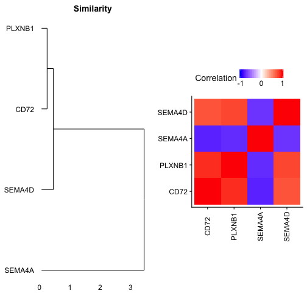
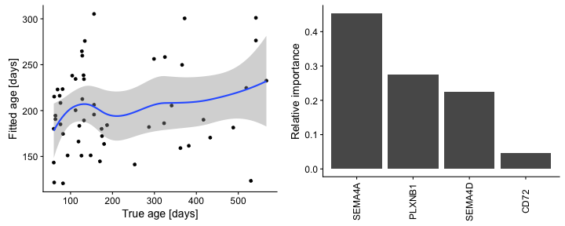

Genetic Lifespan Explorer
========================================================
author: Daniel Acker
date: 11/11/2017
autosize: true

Genetic lifespan dataset
========================================================

- Skene, Roy, and Grant (2017) quantified gene expression in mouse hippocampi sampled across the lifespan
- The dataset covers both male and femle mice from two common laboratory strains
  - C57Bl/6
  - 129s5
- The dataset revealed previously undiscovered age-dependent changes in Schizophrenia genes


Genetic lifespan explorer app
========================================================

- The app allows users to search for their favorite genes in the dataset
- Several genes can be queried simultaneously
- New and interesting patterns can be found
  - The gene SEMA4D encodes a transmembrane signalling protein (Sema4D) important for synapse development in early life. 
  - Exploring this dataset, I found that SEMA4D expression is tightly correlated with genes that encode Sema4D receptors (PLXNB1 & CD72)
  - However, SEMA4D expression is anticorrelated with the related gene SEMA4A

Three output modes
========================================================

- 1) Scatterplots to view changes in genes by age



Three output modes
========================================================

- 2) Correlation matrices and dendrograms to track similarity in expression patterns



```
TableGrob (1 x 2) "arrange": 2 grobs
  z     cells    name           grob
1 1 (1-1,1-1) arrange gtable[layout]
2 2 (1-1,2-2) arrange gtable[layout]
```


Three output modes
========================================================

- 3) Predictivity plots to show how well a gene or set of genes can be used to predict a mouse's age
  - Normalized expression data is fit using a random forest model
  - Displayed results represent out of sample predictions on a test dataset withheld during model training



